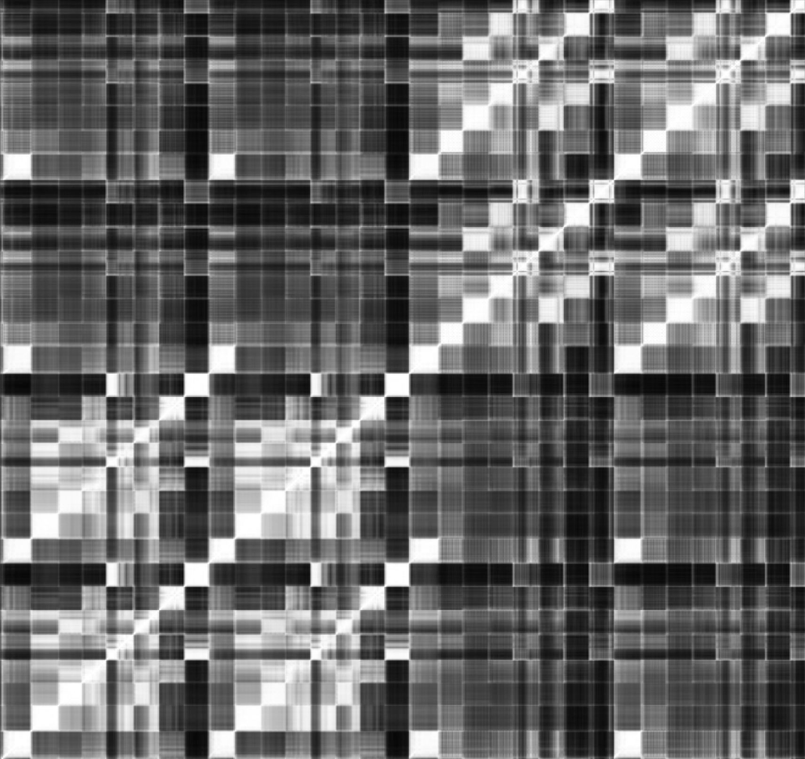

<p align="center">
    <h1>Multifractal Comparison of Billboard and AI-Generated Music</h1>
</p>

<p align="center">
    
</p>

<p align="center">
    <a href="https://doi.org/10.1145/3746027.3758168">📑 Paper</a> &nbsp;|&nbsp; 🎵 <a href="https://zhangkkevin.github.io/billboard-ai-fractal-comparison/">Listening Samples</a> &nbsp;|&nbsp; 📊 <a href="https://zenodo.org/placeholder">Dataset</a>
</p>

This repository contains code and data for performing fractal analysis (DFA and MFDFA) on Billboard music and AI-generated music, specifically,
- **Billboard Top 5 songs** (1950-2024) - Human-created music
- **AI-generated music** from multiple models:
  - **[Suno v4.5](https://suno.com/)** - Latest AI music generation model
  - **[DiffRhythm](https://github.com/ASLP-lab/DiffRhythm)** - Diffusion-based music generation
  - **[YuE](https://github.com/multimodal-art-projection/YuE)** - Neural music synthesis model

Pre-computed results are available in `data/results` for:
- **DFA results**: Alpha values, intercepts, and fit statistics
- **MFDFA results**: Alpha width, alpha peak, spectrum skew, and H(q) values

Due to copyright restrictions, Billboard audio files are **NOT** included in the dataset.

## 🚀 Quick Start

### Prerequisites

- Python 3.10+
- Conda or pip package manager
- FFmpeg (for audio processing)

**Ubuntu/Debian:**
```bash
sudo apt-get update
sudo apt-get install ffmpeg
```

**macOS:**
```bash
brew install ffmpeg
```

**Windows:**
Download FFmpeg from [https://ffmpeg.org/download.html](https://ffmpeg.org/download.html)

### Installation

1. **Clone the repository**
   ```bash
   git clone https://github.com/zhangkkevin/billboard-ai-fractal-comparison.git
   cd billboard-ai-fractal-comparison
   ```

2. **Create and activate conda environment**
   ```bash
   conda create -n fractal_analysis python=3.10
   conda activate fractal_analysis
   ```

3. **Install dependencies**
   ```bash
   pip install -r requirements.txt
   ```

## 🔬 Analysis Scripts and Notebooks

### Analysis Scripts
- **`analysis/dfa_batch_amplitude_envelope.py`** - Detrended Fluctuation Analysis on amplitude envelopes
- **`analysis/mfdfa_batch_amplitude_envelope.py`** - Multifractal Detrended Fluctuation Analysis on amplitude envelopes

### Jupyter Notebooks
- **`notebooks/dfa_music_structure.ipynb`** - DFA analysis and visualization
- **`notebooks/mfdfa_music_structure.ipynb`** - MFDFA analysis and visualization

### Usage
```bash
# Run DFA analysis
python analysis/dfa_batch_amplitude_envelope.py

# Run MFDFA analysis  
python analysis/mfdfa_batch_amplitude_envelope.py
```

**Note**: Server versions of scripts and notebooks (with `_server` suffix) contain copyrighted content and are excluded from this repository.
   
## 📁 Data Structure

### Required Directory Structure for Batch Analysis

```
audio_data/
├── billboard/
│   └── audio_files/
├── suno_v4_5/
│   └── audio_files/
├── diffrhythm/
│   └── audio_files/
└── yue/
    └── audio_files/
```

### File Naming Convention

Audio files should follow this naming pattern:
```
YYYY_POSITION_ARTIST_TITLE.mp3
```

Examples:
- `2020_01_Taylor Swift_Cardigan.mp3`
- `1958_02_Elvis Presley_All Shook Up.mp3`

## 📚 Citation

If you use this code in your research, please cite:

```bibtex
@inproceedings{zhang2025multifractal,
  title={Multifractal Comparison of Billboard and AI-Generated Music},
  author={Zhang, Kevin Kailun and Sun, Ying and Xiong, Hui},
  booktitle={Proceedings of the 33rd ACM International Conference on Multimedia (MM '25)},
  pages={1--10},
  year={2025},
  organization={ACM},
  doi={10.1145/3746027.3758168},
  isbn={979-8-4007-2035-2/2025/10}
}
```

## 📞 Contact
If you are interested in this work and want to message us, feel free to leave a email to `kkzhang825@connect.hkust-gz.edu.cn`.